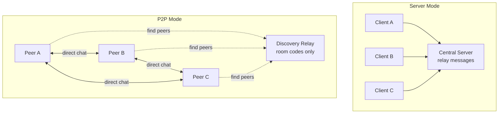

# Sandpiper

Sandpiper is a minimal terminal chat system with **two operation modes**: traditional centralized server and modern peer-to-peer (P2P). In server mode, a Python relay runs on a host and clients connect via TCP. In P2P mode, clients connect directly to each other using a lightweight discovery system inspired by [croc](https://github.com/schollz/croc).

> Status: Server mode is stable. P2P mode is under active development.

## Features

### Server Mode (Stable)
- **Centralized relay**: All messages flow through a central server
- **LAN + Internet**: Works locally or via `ngrok tcp` tunneling
- **Zero setup**: Just start server and connect clients

### P2P Mode (Coming Soon)
- **Direct connections**: Clients chat peer-to-peer without server dependency
- **Room codes**: Human-friendly pairing like "pine-ocean-42"
- **Discovery relay**: Lightweight coordination service (runs on your ThinkPad)
- **Auto-fallback**: Seamlessly switches to server mode if P2P fails
- **NAT traversal**: Works through firewalls and routers

## Goals
- **Simple**: Python 3.10+ with asyncio TCP sockets, zero external dependencies
- **Portable**: Runs on Linux/macOS/Windows terminals
- **Reachable**: Works over LAN, internet (ngrok), or direct P2P
- **Resilient**: Multiple connection strategies with intelligent fallbacks
- **Private**: Optional end-to-end encryption for P2P mode
- **Minimal protocol**: Newline-delimited JSON messages

## Architecture



## Repo Layout
```
sandpiper/
├── server/
│   └── server.py              # Centralized relay server
├── client/
│   └── client.py              # Chat client (both modes)
├── relay/                     # P2P discovery components
│   ├── discovery_relay.py     # Lightweight room code coordinator
│   ├── room_manager.py        # Room code generation & management
│   └── nat_helper.py          # NAT traversal assistance
├── docs/
│   ├── croc-style-p2p-specification.md  # P2P technical design
│   └── deployment.md          # ThinkPad + ngrok setup
├── requirements.txt
├── README.md
├── LICENSE
└── chat_project_roadmap.md
```

## Quick Start - Server Mode (Current)

### Local LAN
1. **Start server**:
   ```bash
   python3 server/server.py --host 0.0.0.0 --port 5000
   ```
2. **Connect clients**:
   ```bash
   python3 client/client.py --host <SERVER_LAN_IP> --port 5000 --nick alice
   ```

### Over Internet (ngrok)
1. **Start server + tunnel**:
   ```bash
   python3 server/server.py --host 0.0.0.0 --port 5000
   ngrok tcp 5000
   ```
2. **Connect from anywhere** using ngrok's endpoint:
   ```bash
   python3 client/client.py --host 2.tcp.ngrok.io --port 17832 --nick alice
   ```

## Quick Start - P2P Mode (Planned)

### Create Room
```bash
# Alice creates a room
python3 client/client.py create --nick alice
# Output: Room created: pine-ocean-42
```

### Join Room
```bash
# Bob joins Alice's room
python3 client/client.py join pine-ocean-42 --nick bob
# Automatic: Try P2P → fallback to server if needed
```

### Discovery Relay Setup
For P2P mode, run the discovery relay on your always-on machine:
```bash
# ThinkPad: Start discovery relay
python3 relay/discovery_relay.py --host 0.0.0.0 --port 8000
ngrok tcp 8000

# Clients automatically use relay for room coordination
```

## Message Protocol

### Core Format
All modes use the same newline-delimited JSON protocol:
```json
{"type":"msg","nick":"alice","text":"hello world","ts":1735812345}
{"type":"notice","text":"alice joined","ts":1735812345}
{"type":"nick","text":"alice is now bob","ts":1735812345}
{"type":"error","text":"invalid message","ts":1735812345}
```

### P2P Extensions
Additional message types for P2P coordination:
```json
{"type":"room_created","code":"pine-ocean-42","expires_at":1735898745}
{"type":"peer_joined","code":"pine-ocean-42","peer":{"nick":"bob","host":"192.168.1.101","port":6002}}
{"type":"peer_left","code":"pine-ocean-42","nick":"bob"}
```

## Usage Examples

### Multi-person Chat (Server Mode)
```bash
# Terminal 1: Start server
python3 server/server.py --host 0.0.0.0 --port 5000

# Terminal 2: Alice joins
python3 client/client.py --host localhost --port 5000 --nick alice

# Terminal 3: Bob joins
python3 client/client.py --host localhost --port 5000 --nick bob

# Terminal 4: Carol joins
python3 client/client.py --host localhost --port 5000 --nick carol
```

### P2P Group Chat (Future)
```bash
# Alice: Create room
python3 client/client.py create --nick alice
# Output: Room created: bright-river-73

# Bob: Join Alice
python3 client/client.py join bright-river-73 --nick bob

# Carol: Join the group  
python3 client/client.py join bright-river-73 --nick carol

# All three now chat directly P2P, with relay only for coordination
```

## Commands

### Current (Server Mode)
- **Join**: `python3 client/client.py --host <server> --port <port> --nick <name>`
- **Quit**: Type `/quit` in chat

### Planned (P2P Mode)
- **Create**: `python3 client/client.py create --nick <name>`
- **Join**: `python3 client/client.py join <room-code> --nick <name>`
- **Server fallback**: `python3 client/client.py server --host <server> --port <port> --nick <name>`

## Development Status

### ✅ Completed (Server Mode)
- [x] Multi-client TCP server with message broadcasting
- [x] Color-coded nicknames with hash-based consistency
- [x] Graceful connection handling and cleanup
- [x] Timestamp formatting and message types
- [x] ngrok compatibility for internet access
- [x] Cross-platform terminal support (Windows/Linux/macOS)

### 🚧 In Progress (P2P Mode)
- [ ] Discovery relay server with room code system
- [ ] P2P client connection management
- [ ] Direct peer-to-peer messaging
- [ ] NAT traversal and hole-punching
- [ ] Automatic fallback to server mode
- [ ] End-to-end encryption for P2P messages

### 📋 Planned Features
- [ ] Room password protection
- [ ] Multi-room support
- [ ] File sharing over P2P connections
- [ ] Mobile client support
- [ ] Web interface option

## Technical Details

### Dependencies
- **Python 3.10+** (uses modern asyncio features)
- **Standard library only** (no external packages required)
- **Optional**: `ngrok` for internet tunneling

### Network Requirements
- **Server mode**: One machine accessible to all clients
- **P2P mode**: Discovery relay accessible to all peers (can be same ThinkPad)
- **Firewall**: Outbound TCP connections required, inbound optional for optimal P2P

### Performance
- **Server mode**: Scales to ~100 concurrent clients per server
- **P2P mode**: Scales naturally with peer count (no central bottleneck)
- **Bandwidth**: Minimal - text-only chat with efficient JSON protocol

## Contributing

See [`docs/croc-style-p2p-specification.md`](docs/croc-style-p2p-specification.md) for detailed P2P architecture and implementation plans.

## Roadmap

See [`chat_project_roadmap.md`](chat_project_roadmap.md) for the complete development plan.

## License

MIT License. Free to use and modify.
